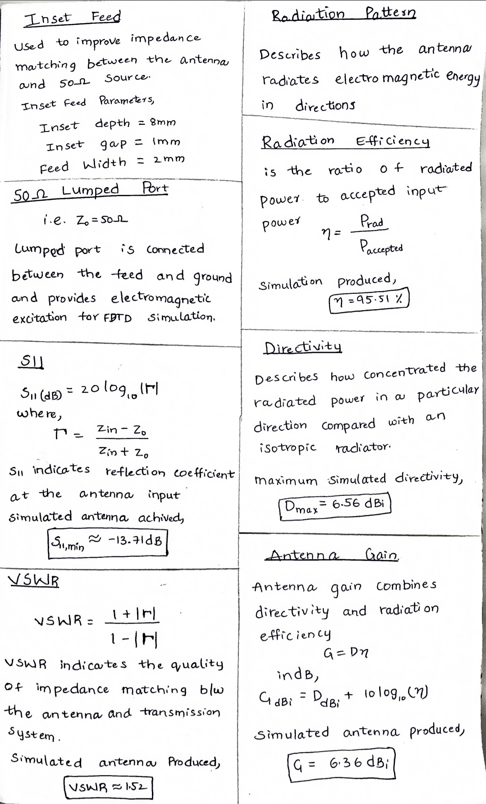

# 2.4 GHz Microstrip Patch Antenna — Design & Simulation

A 2.4 GHz rectangular microstrip patch antenna designed and simulated using
Python and openEMS.

The project focuses on antenna design calculations, electromagnetic simulation,
impedance matching, S-parameter analysis, VSWR, and far-field radiation
characteristics.

---

## 📌 Project Overview

This project implements and analyzes a rectangular microstrip patch antenna
operating around the 2.4 GHz ISM band.

The antenna was designed using standard microstrip patch antenna equations and
then modeled and simulated using the openEMS electromagnetic solver through
Python.

The final design uses an inset-fed rectangular patch with a 50 Ω lumped port.

### Project Flow

Design equations
      ↓
Calculate initial dimensions
      ↓
Create antenna geometry in Python
      ↓
Define substrate, ground and patch
      ↓
Add inset feed and 50 Ω port
      ↓
Generate simulation mesh
      ↓
Run FDTD electromagnetic simulation
      ↓
Calculate S11 and VSWR
      ↓
Calculate far-field radiation characteristics
      ↓
Analyze and tune the antenna

---

## 🎯 Objectives

- Design a rectangular microstrip patch antenna for 2.4 GHz.
- Calculate initial patch dimensions using standard antenna equations.
- Implement the antenna geometry using Python and openEMS.
- Understand electromagnetic simulation using the FDTD method.
- Analyze input matching using S11.
- Calculate and analyze VSWR.
- Obtain far-field radiation characteristics.
- Analyze E-plane and H-plane radiation patterns.
- Calculate directivity, efficiency and gain from simulation results.
- Understand the effect of changing antenna dimensions on resonance.

---

## 🛠️ Tools & Technologies

- Python
- NumPy
- Matplotlib
- CSXCAD
- openEMS
- FDTD electromagnetic simulation
- Antenna Theory
- Microstrip Patch Antenna Design
- S-Parameter Analysis

---

## 📐 Antenna Specifications

| Parameter | Value |
|---|---:|
| Operating Frequency | 2.4 GHz |
| Substrate | FR4 model |
| Relative Permittivity (εr) | 4.3 |
| Substrate Thickness | 1.6 mm |
| Substrate Width | 58 mm |
| Substrate Length | 65 mm |
| Patch Width | 38.37 mm |
| Patch Length | 28.95 mm |
| Feed Width | 2 mm |
| Feed Length | 10 mm |
| Inset Depth | 8 mm |
| Inset Gap | 1 mm |
| Port Resistance | 50 Ω |

---

## 📐 Antenna Design Calculations

The initial dimensions of the rectangular microstrip patch antenna were
calculated using standard microstrip patch antenna design equations.

### Design Parameters

| Parameter | Symbol | Value |
|---|---|---:|
| Design frequency | \(f_0\) | 2.4 GHz |
| Relative dielectric constant | \(\epsilon_r\) | 4.3 |
| Substrate thickness | \(h\) | 1.6 mm |
| Speed of light | \(c\) | 300,000,000 m/s |
| Target impedance | \(Z_0\) | 50 Ω |

---


---

## 📊 Analytical Dimensions vs Final Simulation Dimensions

The analytical equations provide the **initial dimensions**. The antenna was
then implemented in openEMS and evaluated using full-wave electromagnetic
simulation.

The final geometry was adjusted to obtain resonance close to the target
frequency.

| Parameter | Analytical Starting Value | Final Simulation Model |
|---|---:|---:|
| Patch Width | 38.37 mm | 38.37 mm |
| Patch Length | 29.76 mm | 28.95 mm |
| Substrate Width | — | 58 mm |
| Substrate Length | — | 65 mm |
| Substrate Thickness | 1.6 mm | 1.6 mm |
| Feed Width | — | 2 mm |
| Feed Length | — | 10 mm |
| Inset Depth | — | 8 mm |
| Inset Gap | — | 1 mm |
| Port Resistance | — | 50 Ω |

The difference between the analytical patch length and the final simulated
length is expected because the analytical equations provide an initial
approximation, while the final design is evaluated using a full-wave
electromagnetic solver.

---



---

## 🧮 Final Design Calculation Summary

| Quantity | Result |
|---|---:|
| Free-space wavelength | 124.91 mm |
| Patch width | 38.37 mm |
| Effective dielectric constant | 3.997 |
| Effective length | 31.24 mm |
| Fringing extension | 0.741 mm |
| Analytical patch length | 29.76 mm |
| Final patch length | 28.95 mm |
| Inset depth | 8 mm |
| Inset gap | 1 mm |
| Feed width | 2 mm |
| Port impedance | 50 Ω |
| Resonant frequency | ~2.405 GHz |
| Minimum S11 | ~−13.71 dB |
| VSWR | ~1.52 |
| Maximum directivity | ~6.56 dBi |
| Radiation efficiency | ~95.51% |
| Gain | ~6.36 dBi |

---

## 🔄 Design-to-Simulation Flow

The overall design process can be summarized as:

$$
f_0,\epsilon_r,h
\rightarrow
W
\rightarrow
\epsilon_{eff}
\rightarrow
L_{eff}
\rightarrow
\Delta L
\rightarrow
L
$$

The calculated dimensions were then used as the starting point for the
full-wave openEMS simulation:

$$
\text{Analytical Design}
\rightarrow
\text{Geometry}
\rightarrow
\text{Mesh}
\rightarrow
\text{FDTD Simulation}
\rightarrow
S_{11},VSWR,\text{Radiation}
$$

The final simulated geometry was evaluated and tuned around the target
frequency of 2.4 GHz.

---

## 🧱 Antenna Structure

The antenna consists of:

1. FR4 substrate
2. Conductive ground plane
3. Rectangular patch
4. Inset feed
5. 50 Ω lumped port

The inset feed moves the feed point into the patch to obtain a better input
impedance match.

---

## 💻 Simulation Methodology

The antenna geometry is created programmatically using Python.

The electromagnetic simulation is performed using openEMS and the
Finite-Difference Time-Domain (FDTD) method.

### Simulation steps

1. Define antenna parameters.
2. Create the substrate material.
3. Create the ground plane.
4. Create the inset-fed patch.
5. Add the feed structure.
6. Define a 50 Ω lumped port.
7. Generate the simulation mesh.
8. Define absorbing boundary conditions.
9. Create the near-field-to-far-field calculation box.
10. Run the FDTD simulation.
11. Calculate S-parameters.
12. Calculate VSWR.
13. Calculate far-field radiation characteristics.
14. Generate E-plane, H-plane and 3D radiation results.

---

## 📊 Simulation Results

The simulated antenna produced a resonance close to the target
frequency.

| Parameter | Simulated Result |
|---|---:|
| Resonant Frequency | ~2.405 GHz |
| Minimum S11 | ~−13.71 dB |
| VSWR at Resonance | ~1.52 |
| Maximum Directivity | ~6.56 dBi |
| Simulated Radiation Efficiency | ~95.51% |
| Simulated Gain | ~6.36 dBi |
| E-plane 3 dB beamwidth | ~90.48° |
| H-plane 3 dB beamwidth | ~91.37° |

> **Note:** The efficiency result is based on the simulation model. The current
> model uses a lossless FR4 representation and does not include physical
> fabrication losses or measurement using a VNA. Therefore, this value should
> not be interpreted as measured real-world antenna efficiency.

---

## 📈 Plots

| S11 | VSWR |
|---|---|
|  |  |

| E-plane | H-plane |
|---|---|
|  |  |

 <h3 align="center">3D Radiation Pattern</h3>

<p align="center">
  
</p>

Simulated 3D Radiation Pattern is spherical which is not desirable for proper 
of the results below are the polar plots of E-plane and H-plane.

| E-plane (polar) | H-plane (polar) |
|---|---|
|  |  |

---

## 📁 Project Structure

```text
2.4GHz-Microstrip-Patch-Antenna/
│
├── README.md
│
├── src/
│   ├── antenna.py
│   └── analyze.py
│
├── results/
│   ├── S11.png
│   ├── VSWR.png
│   ├── E_plane.png
│   ├── H_plane.png
│   └── 3D_pattern.png
│
└── docs/
    └── Project_Report.pdf
```

## Running it

```bash
python antenna.py     # runs the EM simulation (several minutes)
python analyze.py     # post-processes results, generates plots + report.txt
```

`analyze.py` can be re-run on its own after the first simulation — it only
reads the saved field data, so you don't need to re-run the FDTD solve to
regenerate plots or tweak post-processing.

**Dependencies:** `openEMS`, `CSXCAD`, `numpy`, `matplotlib`, `h5py`

---

## 🔍 What I Actually Learned

This project taught me more about antennas than any single antenna I'd
studied before. Antenna parameters are crucial, but antenna design alone
isn't enough — real-world performance also depends on the operating
environment, the radiation field, the specific use case the antenna is
built for, and noise. It's not just about designing an antenna on paper;
it's about correctly fitting it to practical use. Plots like S11, VSWR, and
radiation pattern aren't just outputs for a report — they're what let you
verify a design will actually hold up outside the simulator.

A few concrete debugging lessons from this build, in case they save someone
else time:

- **A tiny mesh cell anywhere tanks your FDTD timestep.** Modeling finite
  (35 µm) copper thickness forced a CFL-limited timestep around 1e-13 s,
  making every run painfully slow. Since skin depth at 2.4 GHz (~1.3 µm) is
  already far thinner than real copper, zero-thickness PEC is both faster
  *and* a more accurate idealization.
- **An inset feed only works if the notch is an actual gap.** My first
  version had the feed touching the patch on both sides of the "notch,"
  so changing inset depth did nothing to S11. Changing inset depth is
  meaningless until you verify the gap geometry is real.
- **Don't trust a derived plot without checking it against raw data.**
  My first 3D radiation pattern looked nearly spherical despite a real
  ~15 dB front-to-back ratio, because it was built from the wrong field
  array. Cross-checking it against `P_rad`-derived directivity (which the
  E/H-plane cuts already agreed with) caught the bug.

---

## ⚠️ Limitations

The current simulation has several limitations:
- The FR4 model is treated as lossless.
- No fabricated antenna was measured using a Vector Network Analyzer (VNA).
- Connector and cable losses are not included.
- Manufacturing tolerances are not included.
- The simulated results may differ from a physically fabricated antenna.

---

## 👨‍💻 Author

- Hemanth Kumar Akkala
- B.Tech — Electronics and Communication Engineering
- Interested in Embedded Systems, Electronics, RF/Antennas and Robotics.

<p align="left">
  <a href="https://www.linkedin.com/in/hemanth-kumar-akkala/"></a>
  <a href="mailto:hemanthboy21gmail.com"></a>
</p>
